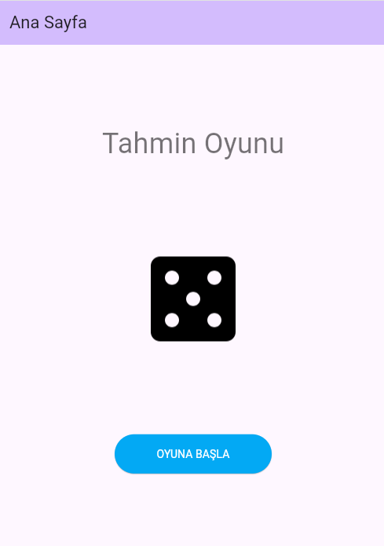
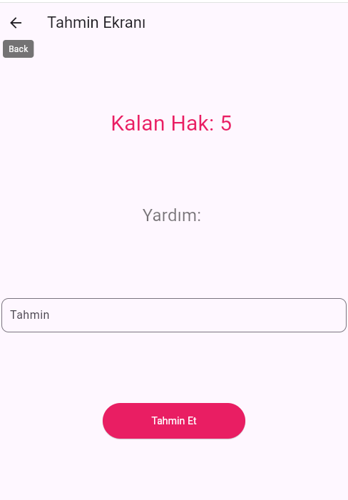

# Number Guessing App
A fun Flutter application where users try to guess a randomly selected number. The app allows users to guess a number between 0 and 20 and provides hints after each guess. Users have 5 attempts to get it right.

## Features
- User-friendly interface
- Random number generation
- Hints based on user guesses
- Separate screens for game results

## App Screenshots

    
    
    
  

